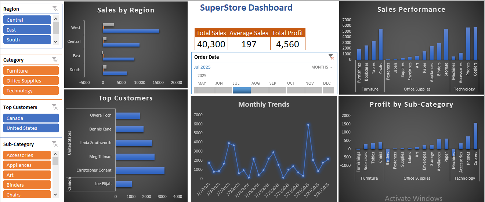

# SuperStore-Sales-Dashboard
Interactive Excel Dashboard built using Pivot Tables, Pivot Charts, Slicers and Timeline Filters to analyze Super Store sales, profit , customer and regional performance. 
## 📊Project Overview
This dashboard was created to transform raw SuperStore sale data into an interactive business report for data analysis and visualization.
The dashboard provides insights into:
* Regional Sales Performance
* Profit and loss analysis
* Category and sub-Category trends
* Top Customer Analysis
* Monthly Sales trends
* Interactive filtering using slicers and timeline filters
### 🧰 Tools and Features Used
* Microsoft Excel Desktop Version
* Pivot Tables
* Pivot Charts
* KPI Cards
* Timeline Filters
* Slicers
* Data Visualization
* Interactive Dashboard Design
### 🧹 Data Cleaning & Preparation
The following preprocessing and cleaning steps were performed before creating the dashboard:
* Remove duplicate records
* Checked for missing/null values
* Standardized data formatting
* Formatted sales and profit columns
* Organized data into structured table format
* Grouped order dates for trend analysis
* Created Pivot Tables for summarized reporting
* Applied filters and slicers for interactive analysis
### 🚀Dashboard Features
* Region-wise sales distribution
* Category-wise sales analysis
* Profit and loss comparison
* Monthly Sales trend and visualization
* Top Customer analysis
* Interactive Filtering through slicers
* Dynamic time-based analysis using timeline filters
#### ⚙️Skills Demonstrated
* Data Cleaning
* Data Analysis
* Data Visulaiztion
* Dashboard Design
* Business Reporting
* Pivot Table Analysis
* Interactive Reporting in Excel
#### 📁Project files
* samplesuperstore 1.xlsx
* Dashboard Screenshot
* README Documentation
## Dashboard Preview

